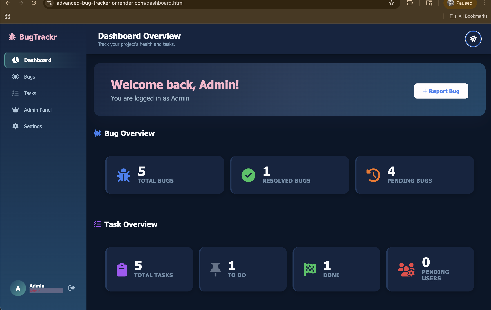

Bug Tracker Application

A full stack Bug Tracker application designed to manage bugs and tasks in a structured and role based workflow.

Features

User authentication including register login and forgot password  
Role based access control with Admin Manager Developer and Tester  
Bug reporting and tracking system  
Task creation assignment and management  
Status updates for tasks and bugs  
Comment system for collaboration  
User settings to update name and password  
Light and dark mode support  

Workflow

Tester reports bugs  
Manager creates and assigns tasks  
Developer resolves bugs and completes tasks  
Admin manages users and monitors the system  

Tech Stack

Frontend HTML CSS JavaScript  
Backend Node.js Express.js  
Database MongoDB  

Tools Used

MongoDB Compass for local development  
Postman for API testing  
MongoDB Atlas for cloud database  
Render for deployment  

Screenshots

Landing Page
! [LandingPage](./Users/pranjalsoni/Documents/bugtrackr/screenshots/LandingPage.png ) 

Login Page

Dashboard  

Task Management  

Bug lists 

Live Demo

https://advanced-bug-tracker.onrender.com

Installation

git clone https://github.com/pranjalll1/Advanced-bug-tracker.git  
cd your-repo-name  
npm install  
npm start  

Future Improvements

Notification system  
File upload for bugs  
Advanced filtering and search  
Email integration  
UI Improvements

Acknowledgement

This project was built as part of learning full stack development  

Contact

Feel free to connect for feedback or suggestions  
